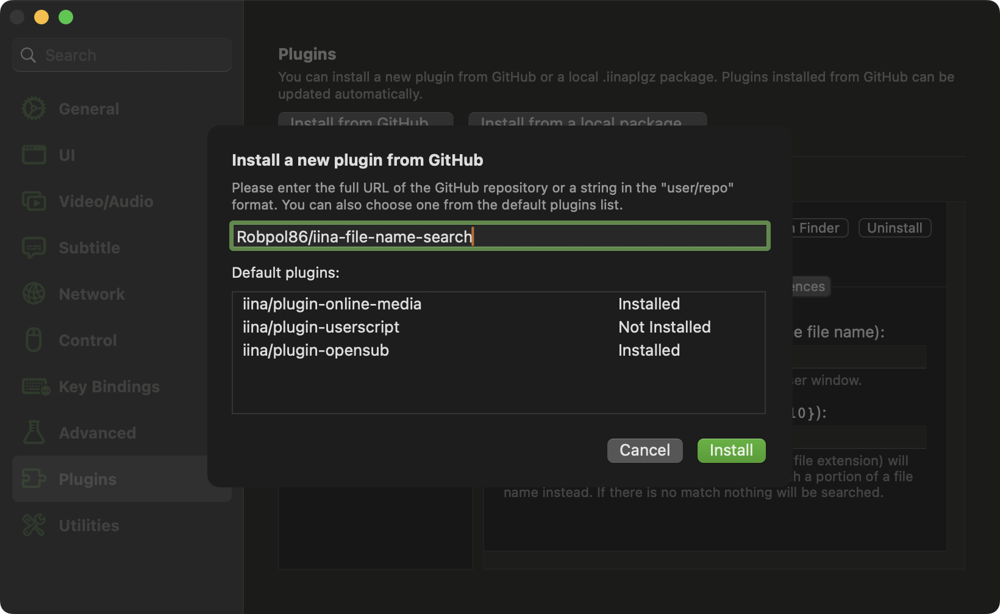
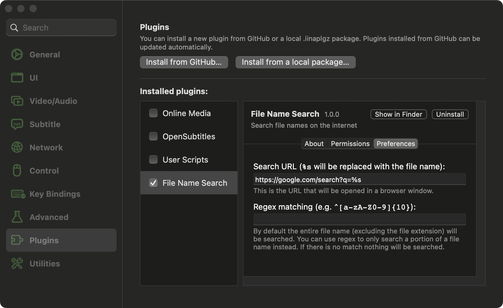
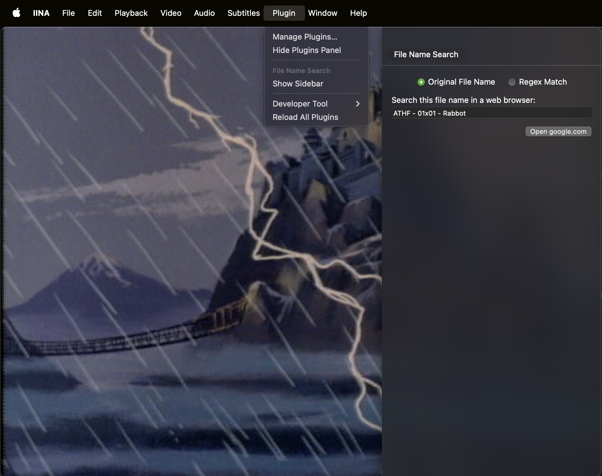

# iina-file-name-search

IINA plugin that lets you search the currently playing file's name on a website.

## Installation

In [IINA](https://iina.io/) go to `Settings > Plugins` then click "Install from GitHub".
Type: `Robpol86/iina-file-name-search`



## Usage

In preferences type in a URL with `%s` which will be replaced by the file name.



Then when a video is playing oppen the side bar (Plugin > File Name Search > Open Sidebar) and click the "Open" button.



## Development

```bash
/Applications/IINA.app/Contents/MacOS/iina-plugin link .
```

Then go to IINA `Settings > Plugins` and enable this plugin.
